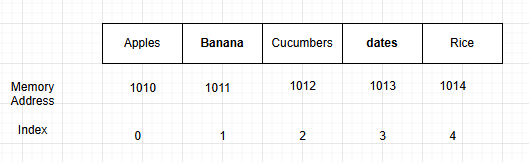

## Importance of Data Structures
A computer program largely resolves around data. A computer program is all about a
receiving, manipulating and returning data. A data structures refer to how data is
organized. Depending on how you choose to organize your data, your program may run
faster or slower by orders of Magnitude.

### The Array
An array is a fundamental data structure in computer science. Array used is used to
store list of data elements. The **index** of an array is the number that represent
position of an element in the array. In most programming languages, we begin counting
the index at 0 ends counting at `n-1`

Example in python:
```python
groceries_array = ["Apple", "Honey", "Orage", "Banana"]
```

**Most data structures are used in four basic ways**:
- **Read**: Reading refers to looking up what value is contained at a perticular index inside the array. Reading from an array actually takes just one step. When a program declares an array, it allowcates a contiguous set of empty cell for use in the program. So, if you were creating an array meant to hold five elements, your computer would find any group of five empty cells in a row and designate it to serve as your array.

    Every cell in computer's memory has a specific address. Each cell's memory address is one number greater than previous cell.

    


    If we tell the computer to read the value at index 3, the computer goes through the following process.

    1. Our array begins with index 0 at memory address 1010
    2. Index 3 will be exactly three slots past index 0
    3. So to find index 3, we would go to memory address 1013, since 1010 + 3 is 1013

    Once the computer jumps to the memory address 1013, it returns the value which is "dates". One of the reasons that the array is such a powerful data structure is that we can look up the value at any index with such speed.

- **Searching**: Searching refers to looking for a particular value within a data structure.

- **Insert**: Insertion refers to adding another value to our data structure.

- **Delete**: Deletion refers to removing a value from our data structure.


### Time Compexity
This is basic introduction about **Time Complexity**. We can measure the speed of an operation in term of how many steps it takes to solve a task or problem. For example if an operation of "A" takes 5 steps and Operation "B" takes 500 steps then we can say Operation "A" will be faster than Operation "B" on all pieces of hardware. 
Measuring the speed of an operation is also known as measuring its **_time complexity_**. 